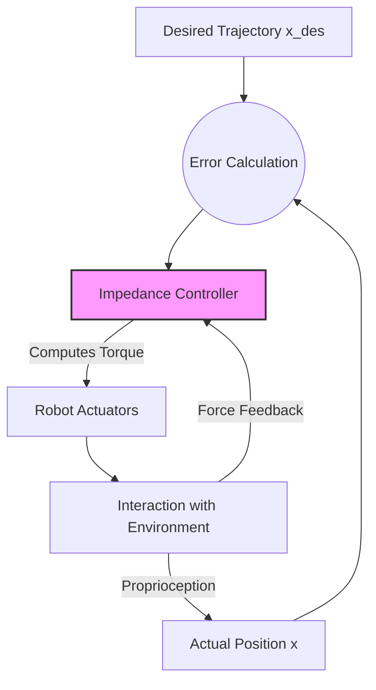
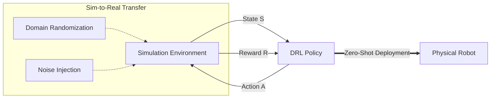

--- 
id: week-7-drl-dexterity
title: ڈیپ ری انفورسمنٹ لرننگ کی dexterity
sidebar_label: ہفتہ 7 DRL Dexterity
---

## ہیومنائیڈ کنٹرول کے لیے ڈیپ ری انفورسمنٹ لرننگ (DRL)

وول-باڈی کنٹرول (WBC) جیسے روایتی کنٹرول کے طریقے روبوٹ اور اس کے ماحول کے درست ریاضیاتی ماڈلز پر انحصار کرتے ہیں۔ اگرچہ یہ طاقتور ہیں، لیکن انہیں انتہائی متحرک تعاملات، غیر ماڈل شدہ خطوں، اور اعلیٰ درجے کی آزادی والے ہیومنائیڈز کی خالص پیچیدگی سے نمٹنے میں دشواری کا سامنا کرنا پڑ سکتا ہے۔ ڈیپ ری انفورسمنٹ لرننگ (DRL) ایک ڈیٹا پر مبنی متبادل پیش کرتی ہے، جو روبوٹس کو سمولیشن میں تجربے سے براہ راست لوکوموشن اور ہیرا پھیری کے لیے پالیسیاں سیکھنے کے قابل بناتی ہے۔

### 1. چھونے اور امپیڈنس کنٹرول برائے مہارت سے پکڑنا

نازک یا نامعلوم اشیاء کو پکڑنے کے لیے صرف انگلیوں کی پوزیشننگ سے زیادہ کی ضرورت ہوتی ہے؛ اس کے لیے لگائی جانے والی قوتوں کو منظم کرنے کی ضرورت ہوتی ہے۔ **امپیڈنس کنٹرول** روبوٹ کو ماس-سپرنگ-ڈیمپر سسٹم کی طرح برتاؤ کرنے کی اجازت دیتا ہے، جو قوت اور حرکت کے درمیان تعلق کو فعال طور پر منظم کرتا ہے۔ یہ "نرم" رویہ دنیا کے ساتھ محفوظ طریقے سے تعامل کے لیے اہم ہے۔

امپیڈنس کنٹرول کے لیے بنیادی کنٹرول قانون کا اظہار یوں کیا جا سکتا ہے:

$$
F_{ext} = K (x_{des} - x) + B (\dot{x}_{des} - \dot{x}) + M (\ddot{x}_{des} - \ddot{x})
$$

جہاں:
*   $F_{ext}$: ماحول کی طرف سے لگائی جانے والی بیرونی قوت۔
*   $x, \dot{x}, \ddot{x}$: حقیقی پوزیشن، رفتار، اور acceleration۔
*   $x_{des}, \dot{x}_{des}, \ddot{x}_{des}$: مطلوبہ حوالہ trajectory۔
*   **$K$ (سختی میٹرکس)**: روبوٹ کتنا "سخت" ہے اس کا تعین کرتا ہے (جیسے سپرنگ مستقل)۔ زیادہ $K$ کا مطلب ہے سخت، کم $K$ کا مطلب ہے لچکدار۔
*   **$B$ (ڈیمپنگ میٹرکس)**: توانائی کے ضیاع کا تعین کرتا ہے (جیسے جھٹکا absorber)، oscillations کو روکتا ہے۔
*   **$M$ (انرشیا میٹرکس)**: سسٹم کا مطلوبہ ظاہری ماس۔

*   **سختی اور ڈیمپنگ:** سختی ($K$) اور ڈیمپنگ ($B$) پیرامیٹرز کو ٹیون کرکے، روبوٹ ایک نازک چیز کو چھوتے وقت لچکدار (نرم) ہو سکتا ہے یا ایک بھاری اوزار پکڑتے وقت سخت ہو سکتا ہے۔
*   **Tactile Feedback:** tactile سینسرز (جیسے ٹچ سکنز یا کلائی پر فورس-ٹارک سینسرز) کو شامل کرنا لوپ کو مکمل کرتا ہے۔ DRL پالیسی ان tactile ریڈنگز کو ریئل ٹائم میں پکڑنے کی قوت کو ایڈجسٹ کرنے کے لیے استعمال کرتی ہے، پھسلنے کا پتہ لگاتی ہے یا کچلنے سے روکتی ہے۔

:::info
**امپیڈنس کیوں؟** ایک خالص پوزیشن-کنٹرولڈ روبوٹ اگر اسے غیر متوقع رکاوٹ کا سامنا کرنا پڑتا ہے تو زیادہ سے زیادہ قوت لگائے گا، ممکنہ طور پر خود کو یا چیز کو توڑ دے گا۔ امپیڈنس کنٹرول اسے "راستہ دینے" کی اجازت دیتا ہے، محفوظ رابطے کو یقینی بناتا ہے۔
:::

### 2. انتہائی متحرک گیٹ جنریشن کے لیے DRL

DRL، خاص طور پر **پراکسیمل پالیسی آپٹیمائزیشن (PPO)** جیسے الگورتھم نے ہیومنائیڈ لوکوموشن میں انقلاب برپا کیا ہے۔ ZMP ٹراجیکٹریز کو دستی طور پر ٹیون کرنے کے بجائے، ہم مسئلے کو مارکوف ڈیسیژن پروسیس (MDP) ٹوپل $(S, A, R, P, \gamma)$ کے طور پر تشکیل دیتے ہیں۔

#### کنٹرول پالیسی کے اہم اجزاء

1.  **اسٹیٹ اسپیس ($S$)**: پالیسی نیٹ ورک کے لیے ان پٹس۔
    *   **Proprioception**: جوائنٹ پوزیشنز ($q$) اور velocities ($\dot{q}$).
    *   **بیس اسٹیٹ**: لکیری رفتار ($v$)، زاویائی رفتار ($\omega$)، اور projected gravity ویکٹر (سمت/جھکاؤ کو محسوس کرنے کے لیے)۔
    *   **تاریخ**: ہموار منتقلی کو یقینی بنانے کے لیے پچھلے اعمال کا ایک بفر۔
2.  **ایکشن اسپیس ($A$)**: پالیسی کے آؤٹ پٹس۔
    *   عام طور پر **PD جوائنٹ پوزیشن کے اہداف**۔ پالیسی ایک residual $\Delta q$ آؤٹ پٹ کرتی ہے جسے ایک معمولی کھڑے پوز میں شامل کیا جاتا ہے۔
3.  **انعام فنکشن ($R$)**: وہ مقصد فنکشن جسے روبوٹ زیادہ سے زیادہ کرتا ہے۔
    *   **Velocity Tracking**: $r_{vel} = \exp(-\|v_{cmd} - v_{actual}\|^2)$
    *   **توانائی کی کارکردگی**: $r_{energy} = -\|\tau\|^2$ (جوائنٹ ٹارکس کو کم کریں)۔
    *   **استحکام**: ٹھوکر کھانے، جوائنٹ کی حدود کی خلاف ورزی، یا ضرورت سے زیادہ عمودی acceleration (jitter) کے لیے سزائیں۔

#### مضبوطی اور پش ریکوری
بے ترتیب خطوں پر تربیت اور سمولیشن کے دوران روبوٹ کو بیرونی قوتوں (دھکے) کا نشانہ بنا کر، پالیسی ابھرتے ہوئے استحکام کی حکمت عملیوں کو سیکھتی ہے۔ یہ ایک دھکے سے بازیافت کرنے کے لیے کراس-اسٹیپ یا اپنے مرکز کو نیچے کرنے کا طریقہ دریافت کرتی ہے، ایسی صلاحیتیں جن کو WBC میں واضح طور پر کوڈ کرنا انتہائی مشکل ہے۔

### 3. سم-ٹو-ریئل لوپ: حقیقت کے فرق کو ختم کرنا

سمولیشن (گیزیبو، آئزک سم، موجوکو) میں تربیت یافتہ پالیسیاں اکثر حقیقت کی دنیا میں ناکام ہو جاتی ہیں کیونکہ **سم-ٹو-ریئل گیپ** — فزکس، سینسر شور، اور ایکچوایٹر dynamics میں تضادات۔ اس فرق کو ختم کرنا مجسم AI کا "ہولی گریل" ہے۔

#### ڈومین رینڈمائزیشن

حقیقی دنیا کو مکمل طور پر ماڈل کرنے کی کوشش کرنے کے بجائے، ہم تربیت کے دوران سمولیشن ماحول کو بے ترتیب بناتے ہیں۔ ہم مختلف کرتے ہیں:
*   **جسمانی پیرامیٹرز**: ماس، فریکشن، موٹر کی طاقت، جوائنٹ ڈیمپنگ۔
*   **سینسری شور**: IMU اور جوائنٹ اینکوڈر ریڈنگز میں bias اور white noise شامل کرنا۔
*   **لیٹنسی**: ایکشن کمانڈ اور عمل درآمد کے درمیان تاخیر کو بے ترتیب بنانا۔

:::note
**ڈومین رینڈمائزیشن کی ضرورت**: ڈومین رینڈمائزیشن کے بغیر، ایک DRL پالیسی سمولیٹر کی بہترین فزکس کے لیے مؤثر طریقے سے "اوور فٹ" ہو جاتی ہے۔ یہ حقیقی روبوٹ پر فوری طور پر ناکام ہو جائے گا کیونکہ حقیقت کبھی بھی صاف، ڈیٹرمینسٹک سمولیشن سے میل نہیں کھاتی۔ فزکس پیرامیٹرز کی ایک *تقسیم* پر تربیت دے کر، پالیسی حقیقی دنیا کے مخصوص (نامعلوم) پیرامیٹرز کے لیے مضبوط ہو جاتی ہے۔
:::

#### اسٹوڈنٹ-ٹیچر ٹریننگ (پریویلیجڈ لرننگ)
ایک "استاد" پالیسی کو **پریویلیجڈ معلومات** (درست فریکشن، گراؤنڈ ٹرتھ ٹیرین کی اونچائی) کے ساتھ تربیت دی جاتی ہے جو حقیقی روبوٹ نہیں دیکھ سکتا۔ پھر ایک "شاگرد" پالیسی کو صرف حقیقت پسندانہ سینسر ڈیٹا (proprioception، شور والی گہرائی) کا استعمال کرتے ہوئے استاد کی نقل کرنے کے لیے تربیت دی جاتی ہے، مؤثر طریقے سے دنیا کی پوشیدہ حالت کا بالواسطہ اندازہ لگانا سیکھتی ہے۔

### خلاصہ
امپیڈنس کنٹرول کی تعمیل کو DRL کی موافقت اور سخت سم-ٹو-ریئل تکنیکوں کے ساتھ ملا کر، ہم سخت، پہلے سے پروگرام شدہ آٹومیٹنز سے سیال، ذہین ہیومنائیڈ روبوٹس کی طرف بڑھتے ہیں جو غیر منظم حقیقی دنیا میں کام کرنے کے قابل ہیں۔

