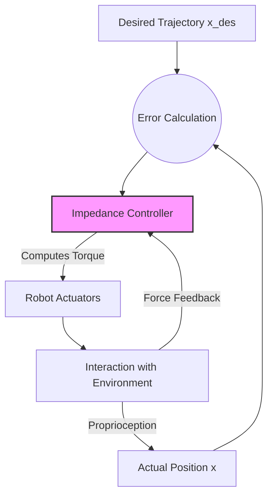
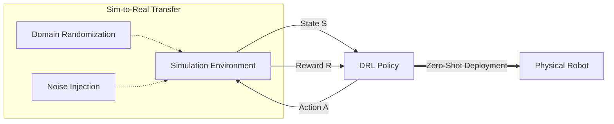

--- 
id: week-7-drl-dexterity
title: Deep Reinforcement Learning Dexterity
sidebar_label: Week 7 DRL Dexterity
---

## Deep Reinforcement Learning (DRL) for Humanoid Control

Traditional control methods like Whole-Body Control (WBC) rely on precise mathematical models of the robot and its environment. While powerful, they can struggle with highly dynamic interactions, unmodeled terrains, and the sheer complexity of high-degree-of-freedom humanoids. Deep Reinforcement Learning (DRL) offers a data-driven alternative, enabling robots to learn policies for locomotion and manipulation directly from experience in simulation.

### 1. Tactile and Impedance Control for Dexterous Grasping

Grasping fragile or unknown objects requires more than just positioning the fingers; it requires regulating the forces applied. **Impedance Control** allows a robot to behave like a mass-spring-damper system, actively managing the relationship between force and motion. This "soft" behavior is crucial for interacting with the world safely.

The fundamental control law for impedance control can be expressed as:

$$
F_{ext} = K (x_{des} - x) + B (\dot{x}_{des} - \dot{x}) + M (\ddot{x}_{des} - \ddot{x})
$$

Where:
*   $F_{ext}$: External force exerted by the environment.
*   $x, \dot{x}, \ddot{x}$: Actual position, velocity, and acceleration.
*   $x_{des}, \dot{x}_{des}, \ddot{x}_{des}$: Desired reference trajectory.
*   **$K$ (Stiffness Matrix)**: Determines how "stiff" the robot is (like a spring constant). High $K$ means rigid, low $K$ means compliant.
*   **$B$ (Damping Matrix)**: Determines energy dissipation (like a shock absorber), preventing oscillations.
*   **$M$ (Inertia Matrix)**: The desired apparent mass of the system.

*   **Stiffness and Damping:** By tuning the stiffness ($K$) and damping ($B$) parameters, the robot can be compliant (soft) when touching a delicate object or stiff when holding a heavy tool.
*   **Tactile Feedback:** Integrating tactile sensors (like touch skins or force-torque sensors at the wrist) closes the loop. The DRL policy inputs these tactile readings to adjust the grip force in real-time, detecting slip or preventing crushing.

:::info
**Why Impedance?** A pure position-controlled robot will apply maximum force if it encounters an unexpected obstacle, potentially breaking itself or the object. Impedance control allows it to "give" way, ensuring safe contact.
:::

### 2. DRL for Highly Dynamic Gait Generation

DRL, particularly algorithms like **Proximal Policy Optimization (PPO)**, has revolutionized humanoid locomotion. Instead of manually tuning ZMP trajectories, we formulate the problem as a Markov Decision Process (MDP) tuple $(S, A, R, P, \gamma)$.

#### Key Components of the Control Policy

1.  **State Space ($S$)**: The inputs to the policy network.
    *   **Proprioception**: Joint positions ($q$) and velocities ($\dot{q}$).
    *   **Base State**: Linear velocity ($v$), angular velocity ($\omega$), and the projected gravity vector (to sense orientation/tilt).
    *   **History**: A buffer of previous actions to ensure smooth transitions.
2.  **Action Space ($A$)**: The outputs of the policy.
    *   Typically **PD joint position targets**. The policy outputs a residual $\Delta q$ added to a nominal standing pose.
3.  **Reward Function ($R$)**: The objective function the robot maximizes.
    *   **Velocity Tracking**: $r_{vel} = \exp(-\|v_{cmd} - v_{actual}\|^2)$
    *   **Energy Efficiency**: $r_{energy} = -\|\tau\|^2$ (minimize joint torques).
    *   **Stability**: Penalties for stumbling, joint limit violations, or excessive vertical acceleration (jitter).

#### Robustness and Push Recovery
By training on randomized terrains and subjecting the robot to external forces (pushes) during simulation, the policy learns emergent stability strategies. It discovers how to cross-step or lower its center of mass to recover from a push, capabilities that are extremely difficult to code explicitly in WBC.

### 3. The Sim-to-Real Loop: Bridging the Reality Gap

Policies trained in simulation (Gazebo, Isaac Sim, MuJoCo) often fail in the real world due to the **Sim-to-Real Gap**—discrepancies in physics, sensor noise, and actuator dynamics. Closing this gap is the "Holy Grail" of embodied AI.

#### Domain Randomization

Instead of trying to model the real world perfectly, we randomize the simulation environment during training. We vary:
*   **Physical Parameters**: Mass, friction, motor strength, joint damping.
*   **Sensory Noise**: Adding bias and white noise to IMU and joint encoder readings.
*   **Latency**: Randomizing the delay between action command and execution.

:::note
**The Necessity of Domain Randomization**: Without Domain Randomization, a DRL policy effectively "overfits" to the perfect physics of the simulator. It will fail instantly on a real robot because reality never matches the clean, deterministic simulation. By training across a *distribution* of physics parameters, the policy becomes robust to the specific (unknown) parameters of the real world.
:::

#### Student-Teacher Training (Privileged Learning)
A "Teacher" policy is trained with **privileged information** (exact friction, ground truth terrain height) that the real robot can't see. A "Student" policy is then trained to mimic the Teacher using only realistic sensor data (proprioception, noisy depth), effectively learning to estimate the hidden state of the world implicitly.

### Summary
By combining the compliance of impedance control with the adaptability of DRL and rigorous Sim-to-Real techniques, we move from rigid, pre-programmed automatons to fluid, intelligent humanoid robots capable of operating in the unstructured real world.